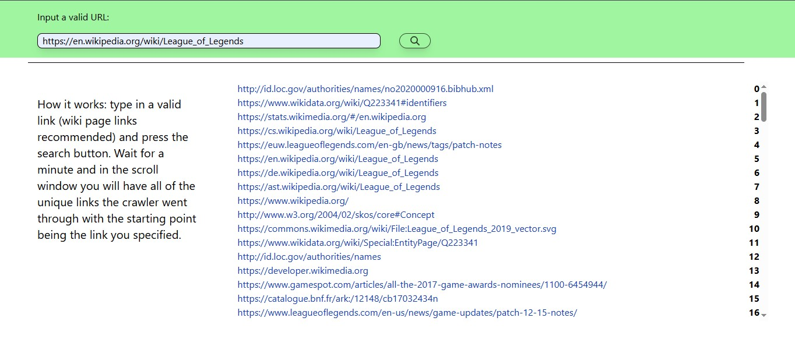

# Containerized Web crawler

## Tech Stack:

- On the frontend:

### TypeScript

### React

### Tailwindcss

and on the backend:

### Java

### Spring

## How to use:

Prerequisite for usage is having docker installed on your machine. Clone the umbrella repository and run docker compose up. Inside of your terminal you will see the reverse proxy, frontend and backend container start up. on your broser visit http://localhost:80 and use.

